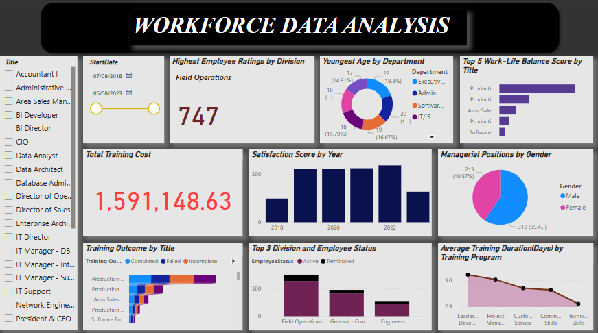
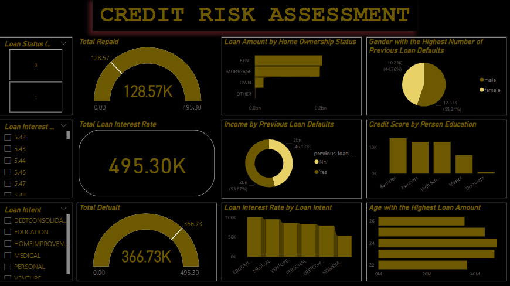

# Project 1

**Title:** [Ecommerce Consumer Behavior Analysis](https://github.com/Tomi-Ara/Tomi-Ara.github.io/blob/main/Ecommerce%20Consumer%20Behavior%20Analysis%20Dashboard.xlsx)

**Tools Used:** Advance Microsoft Excel (Pivot table, Pivot chart, Slicer, and Timeline)

**Project Description:** This project entails analysing ecommerce consumer behaviour to identify trends and purchasing patterns across various purchase categories. It is structured to offer a thorough analysis of essential performance indicators. This dashboard enables stakeholders to seamlessly track and analyse ecommerce consumer behaviour across various factors, including age, payment method, purchase category, and time of purchase. Key features of the dashboard include:

Online Purchase by Gender: A graphical depiction of gender distribution, segmented by online purchase channel.

Top 5 Purchase Category: An analysis of the top-selling categories, offering valuable insights into evolving purchase trends over time.

Highest Revenue by Age: Showcases the highest revenue figures, enabling straightforward comparisons across different age groups.

Most used Payment Method: Identifies the most frequently used payment method among consumers, providing insights into transaction preferences.

Customer Satisfaction by Device Used: Illustrates customer satisfaction levels, segmented by the type of device used for purchases.

Also, the dashboard incorporates interactive slicers and a timeline for the following:

Payment Method: Track shifts in payment method popularity over different time periods.

Purchase Category: Dive deeper into the performance of specific purchase categories, uncovering detailed trends and insights at a precise level.

Device used for Shopping: Examine how different devices influence shopping behaviour.

Time of Purchase: Filter data dynamically to analyse purchase periods for a specific month, year, or a customized range of months and years.

**Key findings:**

Age Group Profitability: Identified the age group with the highest revenue and highlighted age where performance could be improved.

Purchase Channel Trends: Analysed purchase channel trends by gender to determine which demographic engages more in online shopping, enabling data-driven strategic planning.

Top Performing Purchase Category: Identified the top performing purchase categories that generate the highest revenue and profit, providing valuable insights to optimize inventory management and marketing strategies.

Payment Method Usage: Analysed consumer payment preferences to identify the most frequently used payment method, providing 
insights into transaction trends and financial behaviour.

Customer Satisfaction: Evaluated customer satisfaction levels across different devices used for shopping, providing insights into user experience and preferences.

This dashboard acts as a vital resource for stakeholders, delivering clear and actionable insights to support informed decision-making and strategic planning.

**Dashboard Overview:**

# Project 2

**Title:** [Health Care Data Analysis](https://github.com/Tomi-Ara/Tomi-Ara.github.io/blob/main/Health%20Care%20Data%20Analysis%20Dashboard.xlsx)

**Tools Used:** Advance Microsoft Excel (Pivot table, Pivot chart, Slicer, and Timeline)

**Project Description:** This project focuses on analysing healthcare data to uncover meaningful insights into industry trends. It is structured to deliver a clear and in-depth analysis of essential performance metrics. The dashboard enables stakeholders to efficiently track and evaluate healthcare performance across various hospitals, medical conditions, and time periods. The dashboard is equipped with key features such as:

Common/Least Medical Condition: Graphical representation showcasing the most and least prevalent medical conditions, providing insights into healthcare trends and disease patterns.

Emergency Admission by Age: A breakdown of emergency admissions segmented by age group, providing insights into demographic trends and healthcare resource allocation.

Billing Amount by Medical Condition: Visual representation of medical conditions ranked by billing amount, highlighting the condition with the highest financial impact. 

Least Prescribed Medication: Identifies the least prescribed medications across hospitals, offering insights into prescribing trends and potential gaps in treatment.

Hospital with the Highest Bill by Diabetic Medical Condition: Highlights the top three hospitals with the highest billing amounts for diabetic medical conditions, offering insights into healthcare costs and resource allocation

Days Admitted by Prescribed Medication: Displays the duration of hospital admissions categorized by prescribed medication, offering insights into treatment effectiveness and patient recovery trends. 

Additionally, the dashboard also incorporates interactive slicers and timelines for:

Hospital: Drill down into specific hospitals to evaluate doctor’s performance, uncovering insights into operational cost, patient outcomes, and healthcare resource allocation. 

Medical Condition: Filter medical condition data to focus on patients, enabling precise analysis of treatment trends and personalized healthcare insights.

Medication: Analyse medication performance in detail, uncovering insights into prescription trends, treatment effectiveness, and patient outcomes across various conditions.

Age: Analyse performance trends by specific age groups to uncover demographic insights, behavioural patterns, and strategic opportunities for optimization.

Discharge Date: Filter discharge date data to analyse performance trends across specific months or years, enabling insights into seasonal variations and healthcare efficiency.

Date of Admission: Filter admission date data to analyse performance trends across specific months or years, uncovering seasonal patterns and healthcare efficiency insights.

**Key findings:** 

Top Medical Condition: Identified the most prevalent medical conditions, providing valuable insights to support research efforts and strategic healthcare planning.

Emergency Admission Trends: Analysed emergency admission trends by age group, uncovering patterns that support strategic healthcare planning and resource allocation.

Billing Amount for Medical Conditions: Visualized medical conditions ranked by billing amount, highlighting the condition with the highest financial impact while showcasing others with lower costs.

Least Prescribed Medication: Identifies the least prescribed medications, offering insights into prescribing trends and supporting inventory management and strategic decision-making.

Hospital Billing Amount: Examined the top three hospitals with the highest billing amounts for diabetic medical conditions, identifying the facility with the greatest costs while highlighting others with lower expenditures uncovering patterns that support strategic healthcare planning and resource allocation.

Admission Volatility: Evaluated admission dynamics by analysing the number of days patients were hospitalized based on prescribed medication, offering insights to refine treatment strategies and improve patient care.

This dashboard serves as a vital tool for stakeholders, enabling them to identify trends, assess risks, and refine healthcare strategies for more effective decision-making.

**Dashboard Overview:**

# Project 3

**Title:** Workplace Safety Data

**SQL Code:** [Workplace Safety SQL Code](https://github.com/Tomi-Ara/Tomi-Ara.github.io/blob/main/Workplace_Safety_Data.sql)

**SQL Skills Used:** 

Data Retrieval (SELECT): Queried and extracted specific information from the database.

Data Aggregation (SUM, COUNT, AGV): Calculated totals and average, such as sales, cost, and  quantities, and counted records to analyze data trends.

Data Filtering (WHERE, GROUP BY, ORDER BY): Applied filters to select relevant data, including filtering by ranges and lists.

Data Source Specification (FROM): Specified the tables used as data sources for retrieval

**Project Description:** Utilized SQL queries to analyse workplace safety, identifying incident trends, risk factors, and performance metrics across various environments. This enables stakeholders to monitor and assess safety performance across plants, departments, shifts, and time periods.

**Technology used:** SQL server

# Project 4

**Title:** Employee Details

**SQL Code:** [Employee Details SQL Code](https://github.com/Tomi-Ara/Tomi-Ara.github.io/blob/main/Employee_Details.sql)

**SQL Skills Used:** 

Data Retrieval (SELECT): Queried and extracted specific information from the database.

Data Aggregation (COUNT, MAX, MIN, AGV): Calculated max, min and average salaries of employees, and counted records to analyze data trends.

Data Filtering (WHERE, BETWEEN, IN, AND, OR, NOT IN, LIKE): Applied filters to select relevant data, including filtering by ranges and lists.

Data Source Specification (FROM): Specified the tables used as data sources for retrieval

**Project Description:** Leveraged SQL queries to analyse employee details, tracking salaries, locations, and project performance metrics. This enables stakeholders to monitor and evaluate workforce performance across different time periods.

**Technology used:** SQL server

# Project 5

**Title:** [Workforce Data Analysis](https://github.com/Tomi-Ara/Tomi-Ara.github.io/blob/main/Workforce%20Data%20Analysis%20Dashboard.pbix)

**Tools Used:** PowerBI (Visualisations- Bar Chart, Pie Chart, Donut Chart, Line Chart, Column Chart, Cards and Slicers)

**Project Description:** This project focused on analysing employee performance and organizational dynamics, leveraging statistical models and data visualization to identify workforce trends and behavioural patterns. By examining key factors such as retention, productivity metrics, and engagement levels, the analysis provided actionable insights to optimize decision-making and enhance organizational effectiveness. The dashboard incorporates the following features:

Highest Employee Ratings by Division: Displays a visual representation of employee ratings across divisions, offering insights into performance trends and workforce dynamics.

Top 5 Work Life Balance Score by Title: Breaks down work-life balance scores by title, offering insights into trends over time and helping organizations refine employee well-being strategies.

Youngest Age by Department: Visualizes the youngest age across departments, enabling easy comparison and insights into workforce demographics.

Total Training Cost: Displays the total training cost incurred, providing a breakdown across departments to support budgeting and workforce development strategies.

Satisfaction Score by Year: Visualizes satisfaction scores across years, enabling trend analysis and insights into employee’s sentiment over time.

Managerial Positions by Gender: Displays the total number of managerial positions occupied by each gender, highlighting the highest representation to support diversity analysis and workforce planning.

Training outcome by Title: Visualizes training outcomes by title, enabling easy comparison across the year to assess effectiveness and refine learning strategies.

Top 3 Division and Employee Status: Analyses the top three divisions by employee status, distinguishing between active and terminated employees to uncover retention trends and workforce dynamics over time.

Average Training Duration (Days) by Training Program: Highlights the average training duration by program, providing easy comparison of training days across different courses and departments.

Included in the dashboard are interactive slicers for:

Start Date: Filter employees start date data to analyse trends across specific years or date ranges, enabling insights into workforce dynamics and hiring patterns.

Title: Analyses title to assess performance trends, providing insights into workforce dynamics and strategic decision-making.

**Key findings:** 

Employee Ratings: Analysed employee ratings across divisions, identifying the highest-rated area hence providing opportunities for improvement.

Work Life Balance Score: Analysed work-life balance scores by title, uncovering patterns that support strategic workforce planning and employee well-being initiatives.

Age by Department: Identified the youngest age across departments, providing insights into workforce demographics to support strategic hiring and managerial decisions.

Training Cost: Evaluated total training costs to uncover cost dynamics, enabling organizations to refine training strategies for optimal resource allocation and workforce development.

Satisfaction Score: Analysed satisfaction scores across years, pinpointing periods where performance could be enhanced to support strategic improvements and workforce engagement.

Managerial Positions: Analysed gender distribution in managerial positions, uncovering patterns that inform strategic workforce planning and diversity initiatives.

Training outcome: Analysed training outcomes by title, providing insights that support training effectiveness and inform managerial decisions for workforce development. 

Employee Status: Examined employee status “active” or “terminated” across divisions to uncover workforce retention trends and inform strategic business decisions.

Training Duration (Days): Evaluated average training duration across training programs, uncovering patterns that inform strategic adjustments for workforce development and efficiency.

This dashboard serves as a critical asset, offering clear, actionable insights to support informed decision-making and strategic workforce planning.

**Dashboard Overview:**

# Project 6

**Title:** [Credit Risk Assessment](https://github.com/Tomi-Ara/Tomi-Ara.github.io/blob/main/Credit%20Risk%20Assessment%20Dashboard.pbix)

**Tools Used:** PowerBI (Visualisations- Bar Chart, Pie Chart, Donut Chart, Line Chart, Column Chart, Gauge, Cards and Slicers)

**Project Description:** This project focuses on analysing financial risk and loan default prediction. The dashboard enables stakeholders to monitor and assess financial risk across credit scores, age groups, income levels, and loan statuses, offering actionable insights for strategic decision-making. The dashboard includes the following features:

Loan Amount by Home ownership status: Visualizes loan amounts segmented by homeownership status, enabling insights into borrowing trends and financial risk assessment.

Total Repaid: Displays the total repaid loan amount based on loan status, providing insights into repayment trends and overall loan interest performance.

Gender with the Highest Number of Previous Loan Default: Compares previous loan defaults by gender, providing insights into borrowing trends and financial risk assessment.

Total Loan Interest Rate: Visualizes total loan interest rates over time, offering insights into interest trends and financial performance.

Income by Previous Loan Defaults: Visualizes income distribution segmented by previous loan defaults, offering insights into financial risk patterns and borrower profiles.

Total Default: Displays the total default loan amount based on loan status, providing insights into repayment trends and overall loan interest performance.

Credit Score by Person Education:  Visualizes credit scores segmented by education level, enabling easy comparison to assess financial literacy and borrowing trends

Loan Interest Rate by Loan Intent: Highlights loan interest rates segmented by loan intent, offering insights into borrowing trends and financial decision-making.

Age with the Highest Loan Amount: Visualizes loan amounts segmented by age, offering insights into borrowing trends and financial risk assessment

In addition, the dashboard includes interactive slicers for:

Loan Status: Analyses loan status “repaid” or “default” to assess overall performance trends, providing insights into financial risk and repayment behaviour.

Loan Interest Rate: Filters loan interest rate performance and gain insights into borrowing trends.

Loan Intent: Analyses loan intent across individuals, providing insights into borrowing trends and financial decision-making patterns.

**Key findings:**

Repaid Total: Analysed total repaid from loan status, providing insights into loan interest rate trends to enhance financial performance and risk management.

Home Ownership Status: Analysed home ownership status in relation to loan amounts, uncovering patterns that inform strategic financial planning and risk assessment.

Gender by Previous Loan Default: Analysed previous loan defaults by gender, providing insights into borrowing trends and financial risk assessment to support strategic decision-making

Total Loan Interest Rate: Identified total loan interest rate to uncover loan status dynamics, providing insights for strategic interest rate adjustments and financial planning.

Previous Loan Default: Analysed income distribution in relation to previous loan defaults, pinpointing areas where performance could be improved for better financial risk management.

Credit Score and Person Education: Analysed credit score patterns in relation to education level, uncovering insights that support strategic financial planning and risk assessment.

Default Total: Revealed total default from loan status, providing insights into loan interest rate trends and supporting strategic financial planning."

Interest Rate and Loan Intent: Analysed interest rate trends in relation to loan intent, uncovering insights into borrowing dynamics and informing strategic financial adjustments.

Age and Loan Amount: Highlighted loan amounts segmented by age, uncovering patterns that inform strategic financial planning and risk assessment.

This dashboard serves as an important analytical tool used to identify trends and assess risks, providing meaningful insights that leads to strategic planning and informed decisions.

**Dashboard Overview:**

