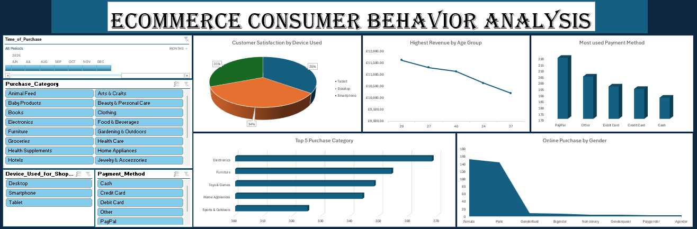
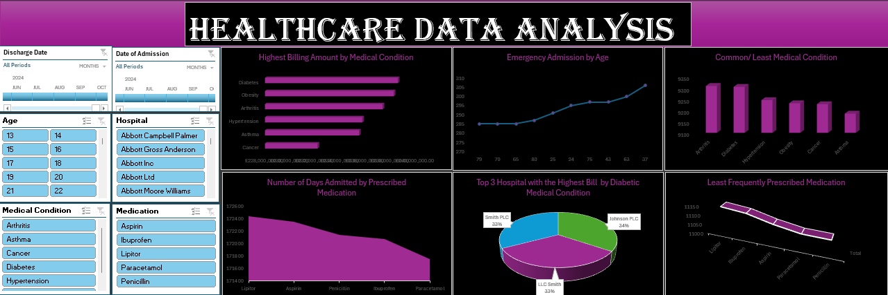

# Project 1

**Title:** [Ecommerce Consumer Behavior Analysis](https://github.com/Tomi-Ara/Tomi-Ara.github.io/blob/main/Ecommerce%20Consumer%20Behavior%20Analysis%20Dashboard.xlsx)

**Tools Used:** Advance Microsoft Excel (Pivot table, Pivot chart, Slicer, and Timeline)

**Project Description:** This project entails analysing ecommerce consumer behaviour to identify trends and purchasing patterns across various purchase categories. It is structured to offer a thorough analysis of essential performance indicators. This dashboard enables stakeholders to seamlessly track and analyse ecommerce consumer behaviour across various factors, including age, payment method, purchase category, and time of purchase. Key features of the dashboard include:

Online Purchase by Gender: A graphical depiction of gender distribution, segmented by online purchase channel.

Top 5 Purchase Category: An analysis of the top-selling categories, offering valuable insights into evolving purchase trends over time.

Highest Revenue by Age: Showcases the highest revenue figures, enabling straightforward comparisons across different age groups.

Most used Payment Method: Identifies the most frequently used payment method among consumers, providing insights into transaction preferences.

Customer Satisfaction by Device Used: Illustrates customer satisfaction levels, segmented by the type of device used for purchases.

Also, the dashboard incorporates interactive slicers and a timeline for the following:

Payment Method: Track shifts in payment method popularity over different time periods.

Purchase Category: Dive deeper into the performance of specific purchase categories, uncovering detailed trends and insights at a precise level.

Device used for Shopping: Examine how different devices influence shopping behaviour.

Time of Purchase: Filter data dynamically to analyse purchase periods for a specific month, year, or a customized range of months and years.

**Key findings:**

Age Group Profitability: Identified the age group with the highest revenue and highlighted age where performance could be improved.

Purchase Channel Trends: Analysed purchase channel trends by gender to determine which demographic engages more in online shopping, enabling data-driven strategic planning.

Top Performing Purchase Category: Identified the top performing purchase categories that generate the highest revenue and profit, providing valuable insights to optimize inventory management and marketing strategies.

Payment Method Usage: Analysed consumer payment preferences to identify the most frequently used payment method, providing 
insights into transaction trends and financial behaviour.

Customer Satisfaction: Evaluated customer satisfaction levels across different devices used for shopping, providing insights into user experience and preferences.

This dashboard acts as a vital resource for stakeholders, delivering clear and actionable insights to support informed decision-making and strategic planning.

**Dashboard Overview:**

# Project 2

**Title:** [Health Care Data Analysis](https://github.com/Tomi-Ara/Tomi-Ara.github.io/blob/main/Health%20Care%20Data%20Analysis%20Dashboard.xlsx)

**Tools Used:** Advance Microsoft Excel (Pivot table, Pivot chart, Slicer, and Timeline)

**Project Description:** This project focuses on analysing healthcare data to uncover meaningful insights into industry trends. It is structured to deliver a clear and in-depth analysis of essential performance metrics. The dashboard enables stakeholders to efficiently track and evaluate healthcare performance across various hospitals, medical conditions, and time periods. The dashboard is equipped with key features such as:

Common/Least Medical Condition: Graphical representation showcasing the most and least prevalent medical conditions, providing insights into healthcare trends and disease patterns.

Emergency Admission by Age: A breakdown of emergency admissions segmented by age group, providing insights into demographic trends and healthcare resource allocation.

Billing Amount by Medical Condition: Visual representation of medical conditions ranked by billing amount, highlighting the condition with the highest financial impact. 

Least Prescribed Medication: Identifies the least prescribed medications across hospitals, offering insights into prescribing trends and potential gaps in treatment.

Hospital with the Highest Bill by Diabetic Medical Condition: Highlights the top three hospitals with the highest billing amounts for diabetic medical conditions, offering insights into healthcare costs and resource allocation

Days Admitted by Prescribed Medication: Displays the duration of hospital admissions categorized by prescribed medication, offering insights into treatment effectiveness and patient recovery trends. 

Additionally, the dashboard also incorporates interactive slicers and timelines for:

Hospital: Drill down into specific hospitals to evaluate doctor’s performance, uncovering insights into operational cost, patient outcomes, and healthcare resource allocation. 

Medical Condition: Filter medical condition data to focus on patients, enabling precise analysis of treatment trends and personalized healthcare insights.

Medication: Analyse medication performance in detail, uncovering insights into prescription trends, treatment effectiveness, and patient outcomes across various conditions.

Age: Analyse performance trends by specific age groups to uncover demographic insights, behavioural patterns, and strategic opportunities for optimization.

Discharge Date: Filter discharge date data to analyse performance trends across specific months or years, enabling insights into seasonal variations and healthcare efficiency.

Date of Admission: Filter admission date data to analyse performance trends across specific months or years, uncovering seasonal patterns and healthcare efficiency insights.

**Key findings:** 

Top Medical Condition: Identified the most prevalent medical conditions, providing valuable insights to support research efforts and strategic healthcare planning.

Emergency Admission Trends: Analysed emergency admission trends by age group, uncovering patterns that support strategic healthcare planning and resource allocation.

Billing Amount for Medical Conditions: Visualized medical conditions ranked by billing amount, highlighting the condition with the highest financial impact while showcasing others with lower costs.

Least Prescribed Medication: Identifies the least prescribed medications, offering insights into prescribing trends and supporting inventory management and strategic decision-making.

Hospital Billing Amount: Examined the top three hospitals with the highest billing amounts for diabetic medical conditions, identifying the facility with the greatest costs while highlighting others with lower expenditures uncovering patterns that support strategic healthcare planning and resource allocation.

Admission Volatility: Evaluated admission dynamics by analysing the number of days patients were hospitalized based on prescribed medication, offering insights to refine treatment strategies and improve patient care.

This dashboard serves as a vital tool for stakeholders, enabling them to identify trends, assess risks, and refine healthcare strategies for more effective decision-making.

**Dashboard Overview:**

# Project 3

**Title:** Workplace Safety Data

**SQL Code:** [Workplace Safety SQL Code](https://github.com/Tomi-Ara/Tomi-Ara.github.io/blob/main/Workplace_Safety_Data.sql)

**SQL Skills Used:** 

Data Retrieval (SELECT): Queried and extracted specific information from the database.

Data Aggregation (SUM, COUNT, AGV): Calculated totals and average, such as sales, cost, and  quantities, and counted records to analyze data trends.

Data Filtering (WHERE, GROUP BY, ORDER BY): Applied filters to select relevant data, including filtering by ranges and lists.

Data Source Specification (FROM): Specified the tables used as data sources for retrieval

**Project Description:** Utilized SQL queries to analyse workplace safety, identifying incident trends, risk factors, and performance metrics across various environments. This enables stakeholders to monitor and assess safety performance across plants, departments, shifts, and time periods.

**Technology used:** SQL server

# Project 4

**Title:** Employee Details

**SQL Code:** [Employee Details SQL Code](https://github.com/Tomi-Ara/Tomi-Ara.github.io/blob/main/Employee_Details.sql)

**SQL Skills Used:** 

Data Retrieval (SELECT): Queried and extracted specific information from the database.

Data Aggregation (COUNT, MAX, MIN, AGV): Calculated max, min and average salaries of employees, and counted records to analyze data trends.

Data Filtering (WHERE, BETWEEN, IN, AND, OR, NOT IN, LIKE): Applied filters to select relevant data, including filtering by ranges and lists.

Data Source Specification (FROM): Specified the tables used as data sources for retrieval

**Project Description:** Leveraged SQL queries to analyse employee details, tracking salaries, locations, and project performance metrics. This enables stakeholders to monitor and evaluate workforce performance across different time periods.

**Technology used:** SQL server
